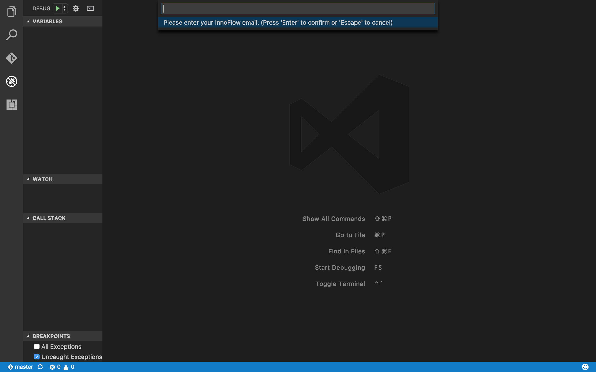
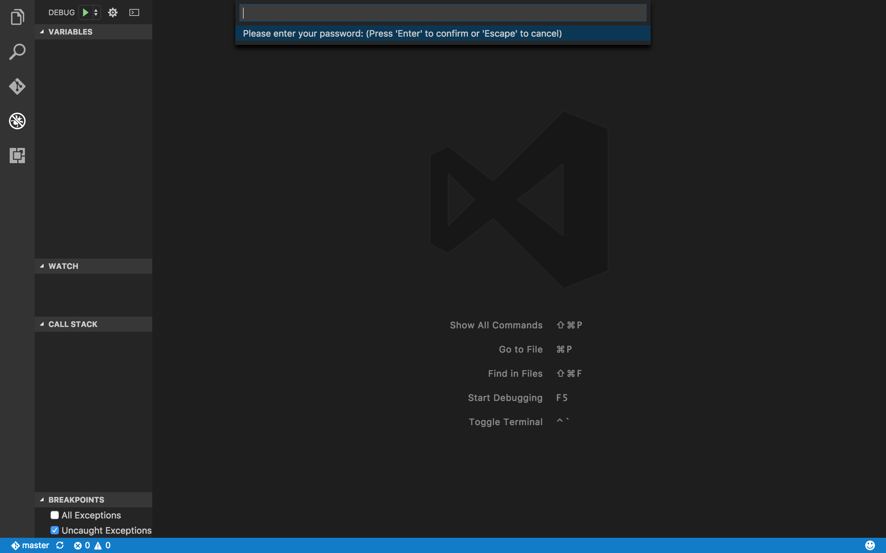
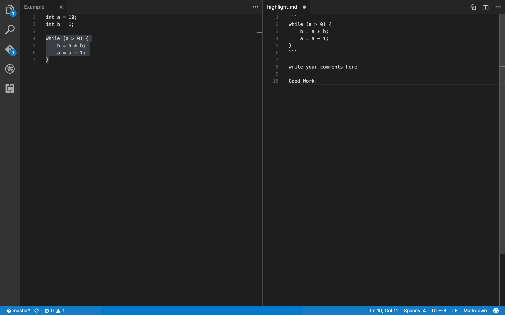
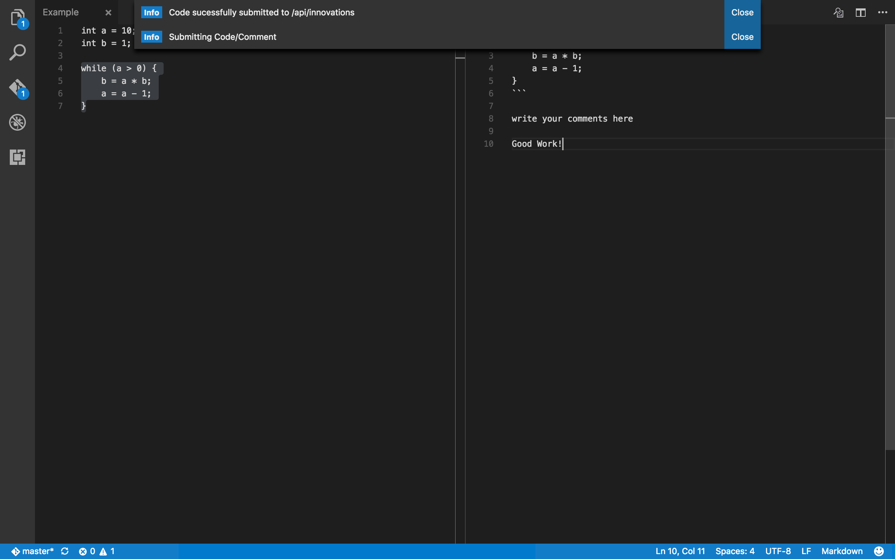

# InnoFlow IDE Extension

InnoFlow is a Visual Studio Team Services extension deicated to :

* Project transparency
* Feedback included
* Innovation showcased

InnoFlow IDE Extension allows users to upload their work to InnoFlow through Vistual Studio Code.

## Features

- Highlight and comment on code
- Upload code to InnoFlow server

## Requirement

* Vistual Studio Code installed

## Usage

The extension works with the following command keys:

* Login with InnoFlow Account: `shift+cmd+l` on Mac, `shift+window+l` on Window

* Open new tab with selected code and allow user to comment: `shift+cmd+b` on Mac, `shift+window+b` on Window

* Submit current selected tab to InnoFlow server: `shift+cmd+h` on Mac, `shift+window+h` on Window

## Release Notes

Version 0.0.6

* Initial Release
